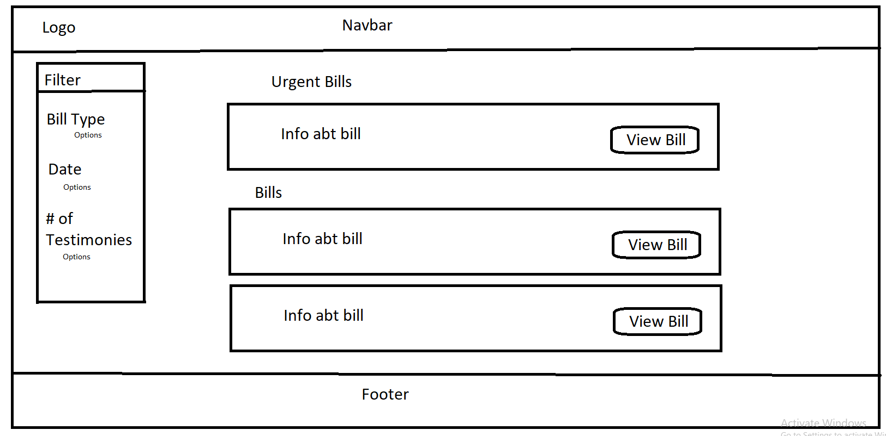
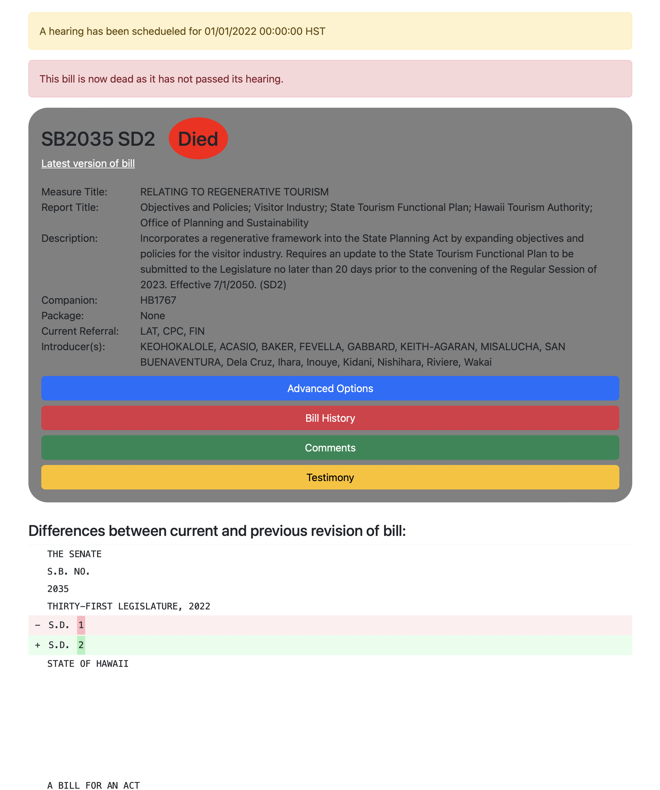
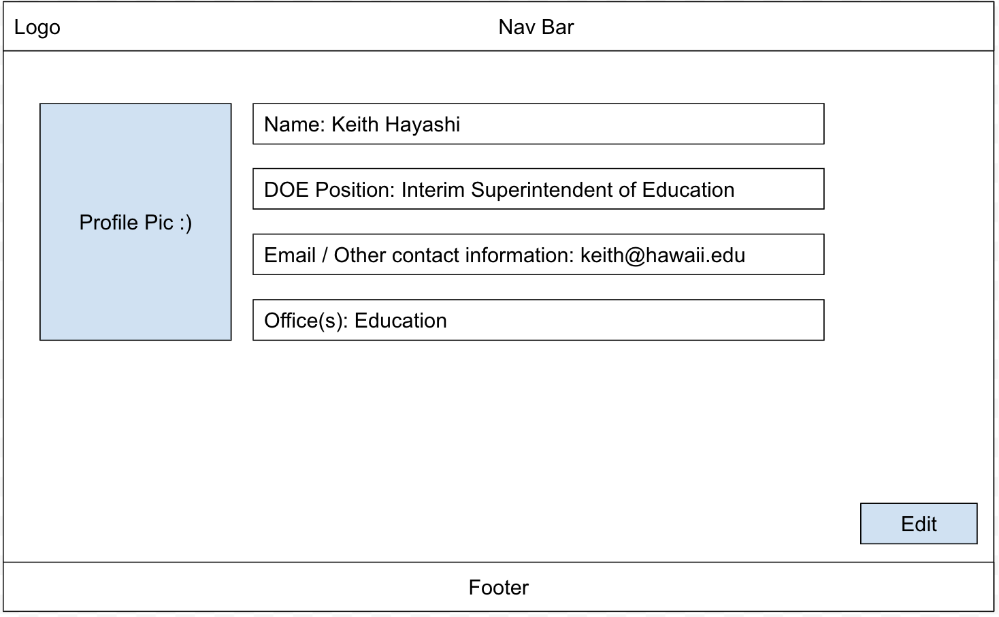
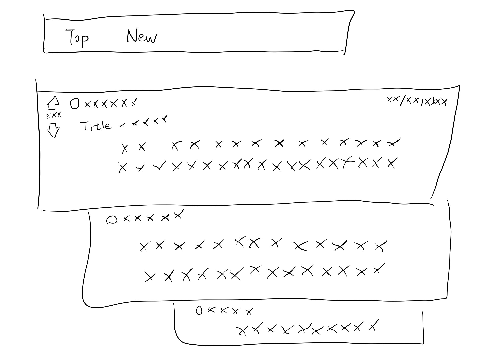
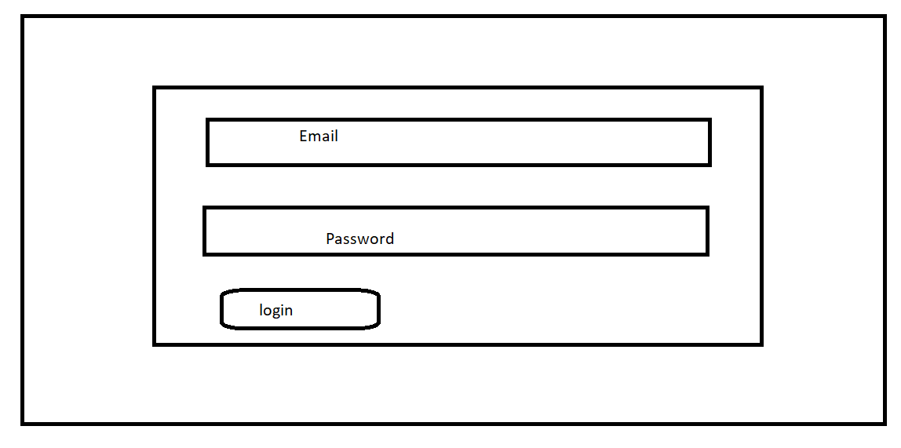
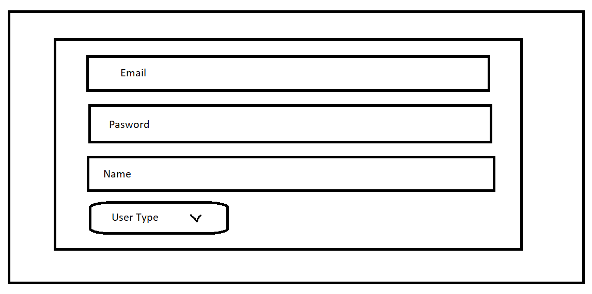
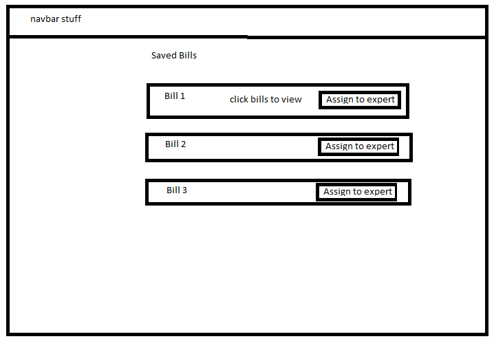

# ICS414 F22 Team 1 "a-doe-bo"

## Table of Contents

* [Team Members](#team-members)
* [Contract](#contract)
* [User Guide](#user-guide)

## Team Members:

<ul>
  <li>
      Gavin Peng
  </li>
    <li>
      Magnus Farstad
  </li>
    <li>
      Kobey Arai
  </li>
    <li>
      Josh Constantino
  </li>
    <li>
      Jackie Wu
  </li>
    <li>
      Michelle Leano
  </li>
    <li>
      Adrian Tam
  </li>
    <li>
      Thane Luna
  </li>
      <li>
      Cole House
  </li>
    <li>
      Li Liang
  </li>
</ul>

## User Guide
The following is a walkthrough of the application.

### Home Page
Upon log in, the user is taken to the home page of the application.

### Bill Details Page
When viewing a bill, the user will see the details of the bill.

### Profile Page
The user has profile that contains their profile picture as well as details of themselves.

### Email
The user will receive emails in regards to their bills of interest containing any hearings and differences that were created

### Discussion Thread Page
Users will be able to participate and communicate with other users with a discussion thread

### Signup Page
First time users will be able to sign up and create their own accounts

### Signin Page
Returning users will log in through the sign in page using their authorized credentials

### Saved Bills (Secretary)
Secretaries will be able to save the bills that is of their interest

## Contract:
Our team contract can be found [here](https://docs.google.com/document/d/1WZUedogeZwPC_EHtHiSMUr5U7Lusnx3uHm7uGawnPG8/edit?usp=sharing).
