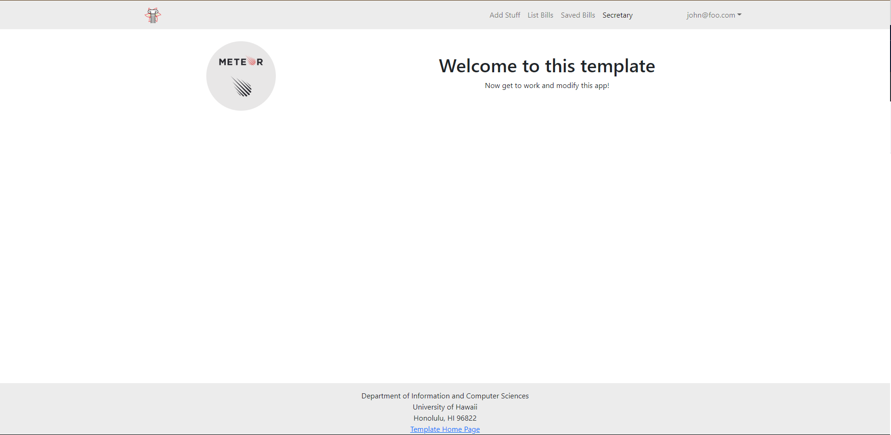
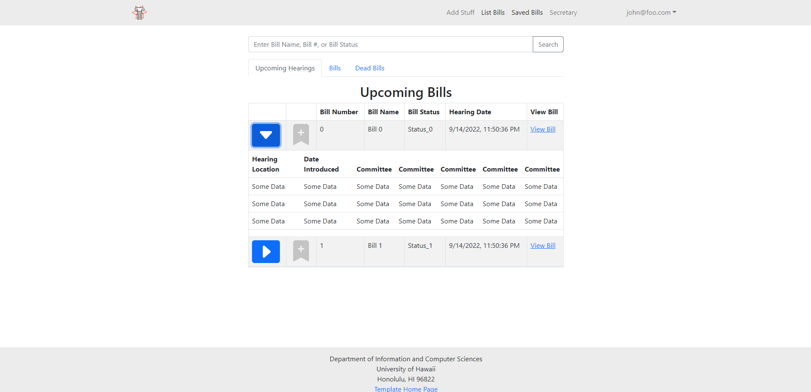
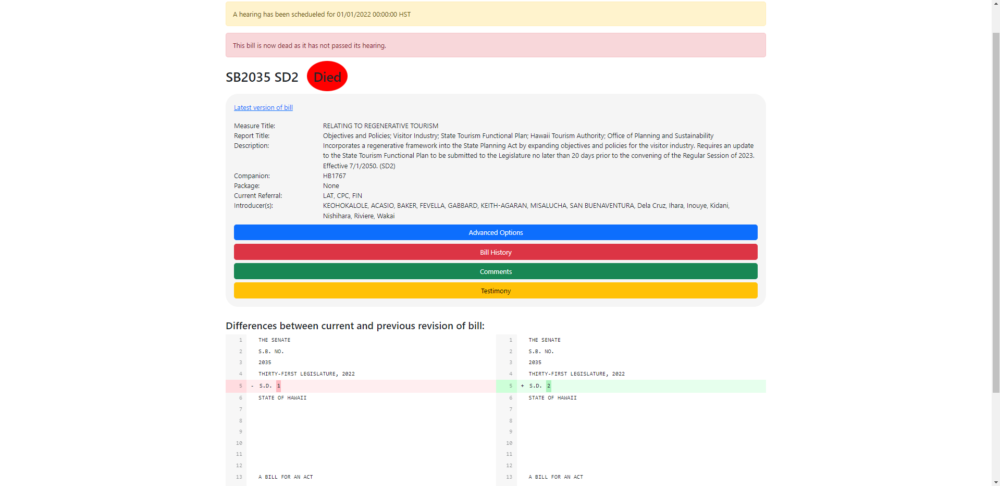
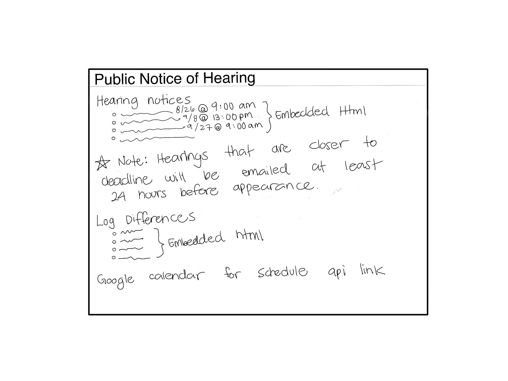
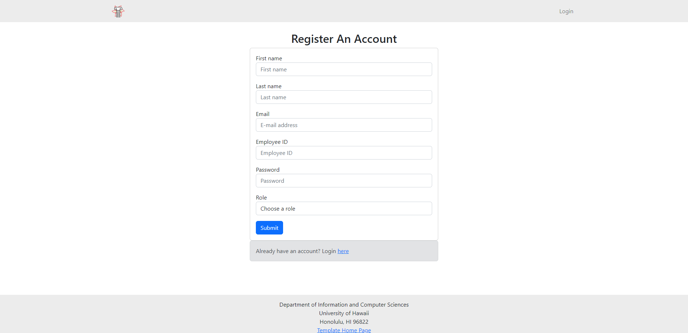
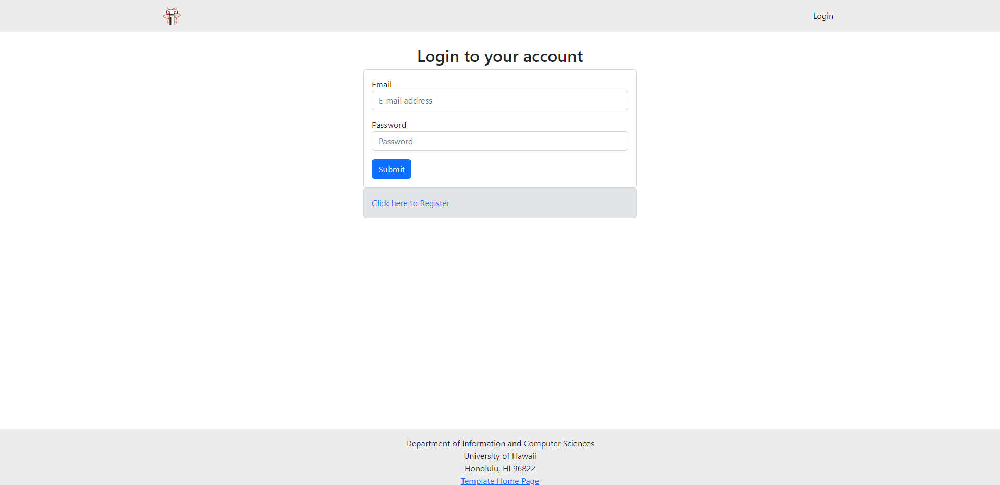

# ICS414 F22 Team 1 "a-doe-bo"

## Table of Contents

* [Team Members](#team-members)
* [Contract](#contract)
* [User Guide](#user-guide)

## Team Members:

<ul>
  <li>Gavin Peng</li>
  <li>Magnus Farstad</li>
  <li>Kobey Arai</li>
  <li>Josh Constantino</li>
  <li>Jackie Wu</li>
  <li>Adrian Tam</li>
  <li>Thane Luna</li>
  <li>Cole House</li>
  <li>Li Liang</li>
</ul>

## User Guide
The following is a walkthrough of the application.

### Landing Page
Upon log in, the user is taken to the home page of the application.

### List Bills Page
The List Bills Page allows the user to see upcoming bills, previous bills, as well as bills that have not passed. At first glance, the bills will include the bill number, name, status, and hearing date. There is also a hyperlink that will show the user the details of the bill. The bills also include a dropdown table that displays the hearing location, introduction date, and the committee

### Bill Details Page
When viewing a bill, the user will see the details of the bill in depth. 

### Profile Page
The profile page contains the user's information. This includes their email, name, and role.

### Email
The user will receive emails in regards to their bills of interest containing any hearings and differences that were created

### Discussion Thread Page
Users will be able to participate and communicate with other users with a discussion thread

### Signup Page
First time users will be able to sign up and create their own accounts

### Signin Page
Returning users will log in through the sign in page using their authorized credentials

### Saved Bills (Secretary)
Secretaries will be able to save the bills that is of their interest

## Contract:
Our team contract can be found [here](https://docs.google.com/document/d/1WZUedogeZwPC_EHtHiSMUr5U7Lusnx3uHm7uGawnPG8/edit?usp=sharing).
